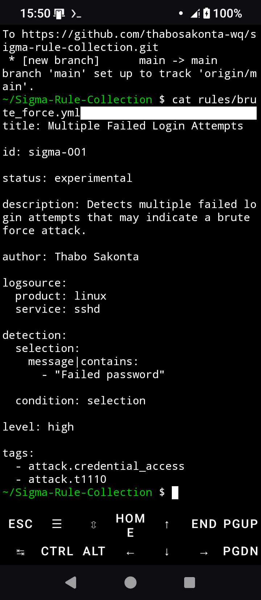
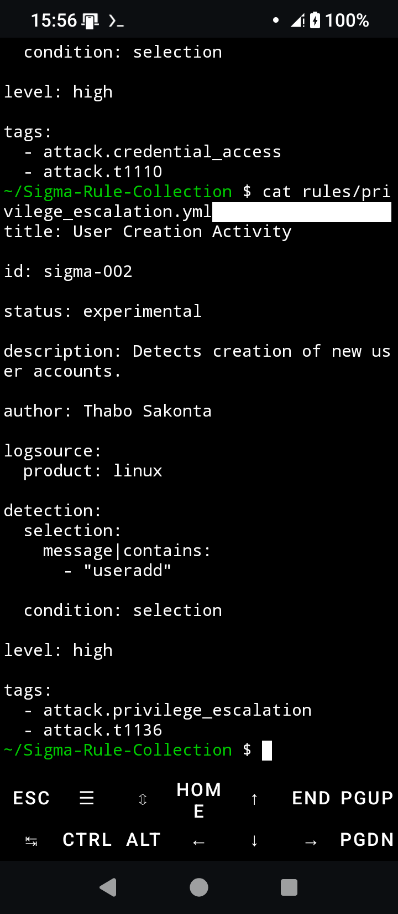
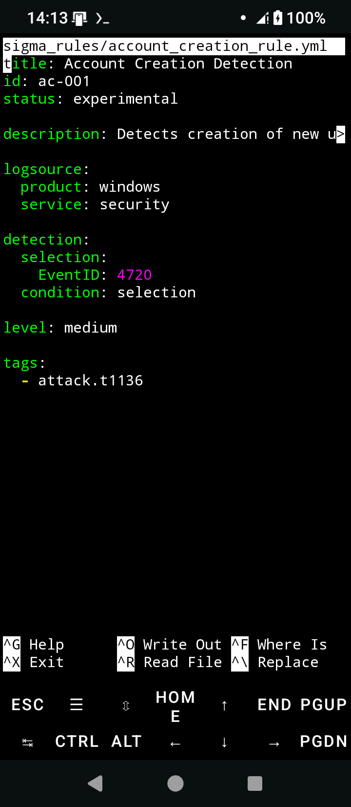
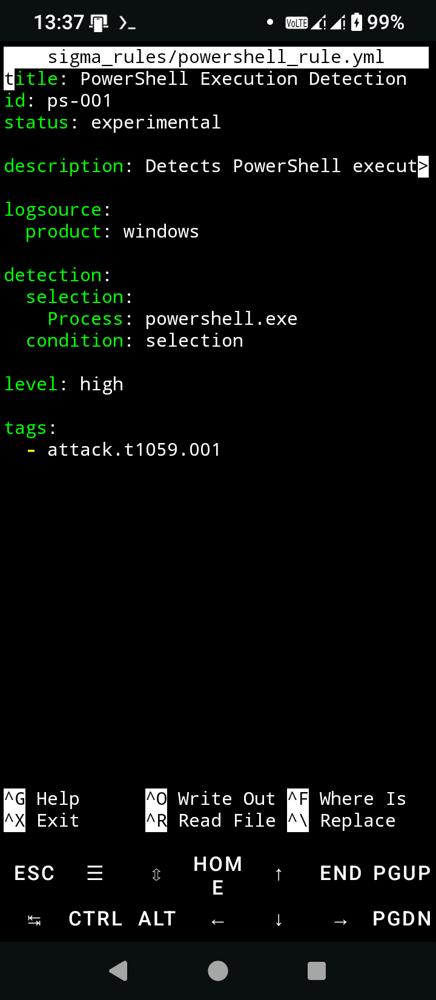

# Detection Engineering Lab

A cybersecurity project demonstrating Sigma rule development, Windows detection engineering, threat detection, and MITRE ATT&CK mapping.

---

# Overview

This project demonstrates how Security Detection Engineers create, document, and validate Sigma rules used to detect suspicious Windows Security Events.

The lab simulates a Detection Engineering workflow by identifying common attack techniques, developing Sigma detection rules, mapping detections to MITRE ATT&CK, and producing professional SOC documentation.

---

# Objectives

- Demonstrate Detection Engineering principles.
- Develop Sigma rules for Windows Security Events.
- Detect common attacker techniques.
- Map detections to the MITRE ATT&CK framework.
- Produce professional detection documentation.
- Demonstrate practical Detection Engineering skills expected of SOC Analysts.

---

## Future Enhancements

- Sigma Rule Integration
- Microsoft Sentinel Integration
- Splunk SIEM Integration
- Elastic SIEM Integration
- Microsoft Defender XDR Integration
- IOC Automation
- Threat Intelligence Feed Integration
- Automated Hunt Scheduling
---

## Features

### Failed Login Detection

- Detects Windows Event ID 4625
- Identifies brute-force authentication attempts

### Privilege Escalation Detection

- Detects Windows Event ID 4672
- Identifies privileged account activity

### Account Creation Detection

- Detects Windows Event ID 4720
- Identifies newly created user accounts

### PowerShell Detection

- Detects Windows Event ID 4688
- Identifies PowerShell execution

### Sigma Rule Development

- Creates Sigma detection rules
- Maps detections to MITRE ATT&CK
- Produces professional detection documentation

---

# MITRE ATT&CK Coverage

| Event ID | Technique | Description |
|----------|-----------|-------------|
|4625|T1110|Brute Force|
|4672|T1078|Valid Accounts|
|4720|T1136|Create Account|
|4688|T1059.001|PowerShell|

---

# Detection Coverage

| Detection | Event ID | Severity |
|----------|----------|----------|
|Failed Login Attempts|4625|High|
|Privilege Escalation|4672|High|
|Account Creation|4720|Medium|
|PowerShell Execution|4688|High|

---

# Reports

- reports/executive_summary.md
- reports/detection_engineering_report.txt
- reports/mitre_mapping.md

---

# Technologies Used

- Sigma
- Bash
- Linux
- Termux
- Git
- GitHub
- Windows Security Event Logs
- MITRE ATT&CK

---

# Project Structure

```text
detection-engineering-lab
├── sigma_rules
│   ├── powershell_rule.yml
│   ├── brute_force_rule.yml
│   ├── account_creation_rule.yml
│   └── privilege_escalation_rule.yml
│
├── kql_queries
│   ├── powershell_detection.kql
│   ├── brute_force_detection.kql
│   ├── account_creation_detection.kql
│   └── privilege_escalation_detection.kql
│
├── sentinel_kql
│   ├── powershell_detection.kql
│   ├── brute_force_detection.kql
│   ├── account_creation_detection.kql
│   └── privilege_escalation_detection.kql
│
├── test_logs
│   ├── brute_force_event.json
│   ├── powershell_event.json
│   └── README.md
│
├── scripts
│
└── README.md
```

---

# Screenshots

## Brute Force Rule



## Privilege Escalation Rule



## Account Creation Rule



## PowerShell Rule



---

# Learning Outcomes

- Detection Engineering
- Sigma Rule Development
- Threat Detection
- Security Monitoring
- MITRE ATT&CK Mapping
- Incident Investigation
- SOC Operations

---

# Author

Thabo Sakonta

Microsoft Certified Security Operations Analyst (SC-200)

GitHub:
https://github.com/thabosakonta-wq

LinkedIn:
https://www.linkedin.com/in/thabo-sakonta-377a3748

---

# License

This project is provided for educational, research, and professional portfolio purposes.
